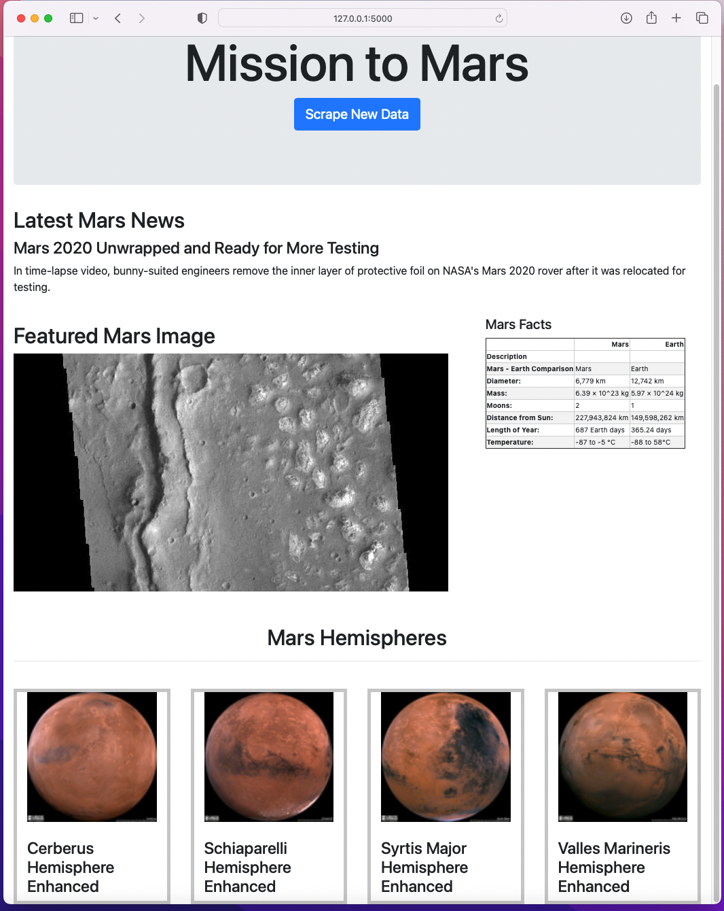

# Web Scraping: Mission to Mars

Author: Rosie Gianan, gianr00@gmail.com

Build with: HTML, PyMongo, Flask, BeautifulSoup, Bootstrap, Python, Pandas and Requests/Splinter 

## Goal:
Build a web application that scrapes various websites for data related to the Mission to Mars and displays the information into a single HTML page.

## Solution:
1. Create a scraping module that visit the following sites and scrapes the data related to "Mission to Mars":
-    Visit the [Mars News site](https://redplanetscience.com/) and scrape the latest News Title and Paragraph Text.
-    Visit the [Featured Space Image site](https://spaceimages-mars.com) and scrape the image URL for the current Featured Mars Image.
-    Visit the [Mars Facts site](https://galaxyfacts-mars.com) and use Pandas to scrape the table containing facts about the planet such as diameter, mass, etc.
-    Visit the [astrogeology site](https://marshemispheres.com/) to obtain high-resolution images for each hemisphere of Mars.

2.    Display all the information scraped from the URLs above into a single HTML page using MongoDB and rendering data with flask.

### HMTL page showing all scraped information: 

 
